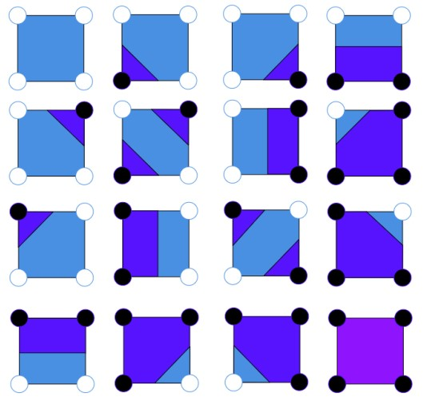

# Drawing Contour Curves in Parallel Using the Marching Squares Algorithm

MMarching Squares is a graphics algorithm introduced in the 1980s that can be used to outline contours within an image. It can be applied to draw contour lines on topographic maps, temperature lines on thermal maps, pressure points on pressure field maps, and more.

The algorithm works by dividing the image into fixed-size squares and then determining the contour within each square. For each square, it determines which of the 16 possible contour configurations is present and draws the corresponding contour segments.

### Rescale image

If the image requires scaling, for each thread, the starting and ending points are calculated based on the x and y coordinates. Scaling is performed using bilinear interpolation, determining the value of each pixel in the final image.

### Sample grid

For the sample_grid step, the image is divided into `step_x * step_y` squares, and the average values of the pixels within each square are calculated. For each thread, the starting and ending points are determined based on the x and y coordinates.

Pixel values at positions `(i, q)` and `(p, i)` are calculated separately using the same parallelization method.

### March
We obtain the pixel values from the final image and replace the values in the contour_map with 0 or 1, depending on the pixel value in the final image. The function is parallelized using the same method as in the previous functions.